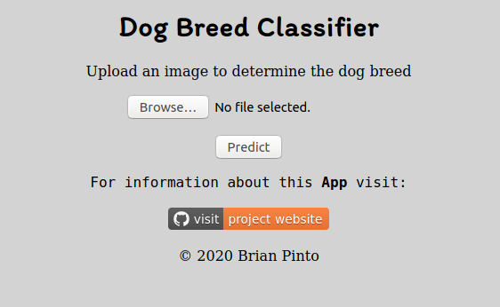
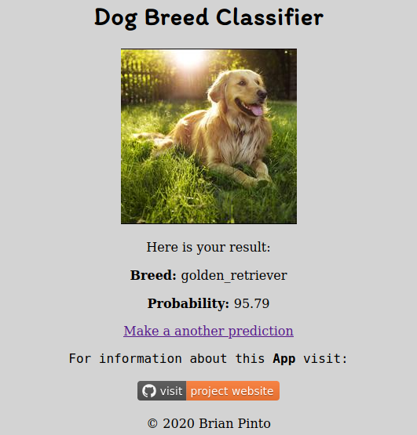

# Using Google Cloud to train and deploy a Dog Breed Classifier

[]()
[](https://www.codefactor.io/repository/github/brianpinto91/dog-breed-prediction-gcloud)

This proect is about demonstrating the usage of custom containers on gcloud ai-platform to train a deep learning model.

>The hallmark of successful people is that they are always stretching themselves to learn new things - Carol S. Dweck

## Table of Contents
* [Introduction](#introduction)
* [Usage](#usage)
* [Model training on GoogleCloud](#Model-training-on-GoogleCloud)
* [App deployment on GoogleCloud](#App-deployment-on-GoogleCloud)
* [Technologies](#technologies)
* [License](#license)

## Introduction

Cloud platforms offer great tools to manage end to end machine learning projects. This project uses the [GoogleCloud][gcloud_link] ai-platform. In particular, automation of the training job using custom [Docker][docker_link] containers is demonstrated. To make the project complete, the deployment of the trained model on [GoogleCloud][gcloud_link] app engine to serve online predictions is also included.

## Usage

There are two parts in this project. The first one is deploying a training job on [GoogleCloud ai-platform][gcloud_link]. And the second part is using the trained model to serve predictions by deploying it on [GoogleCloud app engine][gcloud_link]

All the instructions here are for **linux** systems. On your computer, first navigate to the directory where you want to download the repository to. Then run the following commands:

```sh
git clone --depth 1 https://github.com/brianpinto91/dog-breed-prediction-gcloud.git
```

### Model training on GoogleCloud
There are different ways to deploy a training job on GoogleCloud ai-platform. If you are using Tensorflow, scikit-learn, and XGBoost, then there are configured runtime verisons with required dependencies that can be directly used. However, if you are using Pytorch, as in this case, then [Docker][docker_link] containers can be used to define the dependencies and deploy the training job.

The dataset for this project is obtained from [Stanford Dogs Dataset][stanford_dog_data_link]. It contains 20,528 images of 120 dog breeds. Since the dataset is huge, it is not included in the github repository.

#### Manually Download Data
You can manually download the images from [here][image_download_link]. The downloaded file will be in the **tar** format. Once dowloaded, extract it and save the extracted **Images** directory in the directory **training/data** of the cloned git repository on your computer.

#### Using Bash script to Download the Data
Open a command line and then navigate to the root of the cloned git repository on your computer. Then run the following command:

```sh
bash ./training/download_data.sh
```
#### Data Preprocessing
All the required data preprocessing can be done using the [training/data_preperation.ipynb](training/data_preperation.ipynb) jupyter-notebook.

#### Setting up GoogleCloud
To deploy a training job on GoogleCloud, you need to have a Googlecloud account and a project that has billing enabled. You can follow instructions in the section **Set up your GCP project** in this [link][cloud_sdk_link]

After completing the above steps, you can use the [Cloud SDK][cloud_sdk_link], to deploy your model training on the GoogleCloud.

First login using the command
```sh
glcloud auth login
```

Create a new project or select your existing project which you will use to deploy the training job. Activate the project in the command line using:
```sh
gcloud config set project <your_gcloud_project_id>
```
#### Exporting project variables
When training on cloud, it is a good practice to name the resources and directories in a structured way. For this purpose, I have defined all the namings in the bash script **export_project_varibles.sh**. You can modify the assigned value of the variables as required, but all the variables are required to move on with this guide. Importantly, use the region same as your project's region. Also change the hostname value the **$IMAGE_URI** accordingly. for example **eu.gcr.io** is for **Europe** region. Hostnames for other regions can be obtained from [here][gcloud_image_hostname_link].

Export all these varibles using the command
```sh
source ./training/export_project_variables
```
#### Building Docker Images
First install [Docker][docker_link] by following this [guide][docker_install_guide].

Depending on whether to train on cpu or gpu, I have created [Dockerfile_trainer_cpu](training/Dockerfile_trainer_cpu) and [Dockerfile_trainer_gpu](training/Dockerfile_trainer_gpu) Docker files respectively. The required python packages for model training are specified in the [training/requiremnets.txt](training/requirements.txt) file and is installed when the docker images are built. I do not recommend using **cpu** to train this model as it takes forever. The cpu docker file is just to show how **cpu** can also be used for example when training a small neural network model.

Use the below command to build the Docker image for gpu training.

```sh
docker build -f Dockerfile_trainer_gpu -t ${IMAGE_URI} . 
```
#### Submitting a training job
First you need to create a cloud bucket where you will export the training data. Assuming you are using the same terminal where the project variables were exported previously, run the following commands:

```sh
gsutil mb -l ${REGION} gs://${BUCKET_NAME}
gsutil -m cp training/data/* ${DATA_DIR}
```

Then you need to push the built docker image to gcloud using:

```sh
docker push ${IMAGE_URI}
```
Later export the job varibles which will be used to identify the results of your training job correctly using time_stamp based naming of directories for logs and models using:

```sh
source ./training/export_job_variables.sh
```

Finally submit the training job using the command:

```sh
gcloud ai-platform jobs submit training ${JOB_NAME} \
		--region ${REGION} \
		--scale-tier BASIC_GPU \
  		--master-image-uri ${IMAGE_URI} \
		-- \
		--model_dir=${MODELS_DIR} \
		--epochs=30 \
		--use_cuda \
		--data_dir=${DATA_DIR} \
		--batch_size=120 \
		--test_batch_size=400 \
		--log_dir=${LOGS_DIR}
```

>Note: Here the line with --\ seperates the gcloud arguments with the command line arguments that are given to the python program running on the docker container.

### App deployment on GoogleCloud

The Googlecloud App engine is used for deploying the trained model. The app uses [Flask][flask_link] and is served using the **WSGI** server [Gunicorn][gunicorn_link]. The python package dependencies are specified in [app/requirements.txt](app/requirements.txt) file. The runtime python verison, the entrypoint, and the hardware instance for GoogleCloud app engine is defined in the [app.yaml](app/app.yaml) file. 

First create a app (ideally in the same glcoud project) using the command:

```sh
gcloud app create <your-app-name>
```

Then navigate to the **app** directory of the cloned github repository on your computer. Create a directory called **models**. Download your trained model from gcloud and copy it into this directory. Rename the model file as **torch_model**. Alternatively, you can choose your own directory and model name and define it in the [app/utils.py](app/utils.py) file using the variable **MODEL_PATH**.

Run the following command on the command line from the **app** directory:

```sh
gcloud app deploy
```
#### App Screenshot

The home page:
<div style="text-align: center;">

</div>

And the prediction results page:
<div style="text-align: center;">

</div>

## Technologies

[](https://forthebadge.com)
<br/><br/>
[](https://flask.palletsprojects.com/en/1.1.x/)
[](https://www.docker.com)
[](https://cloud.google.com)
[](https://flask.palletsprojects.com/en/1.1.x/)
[](https://gunicorn.org)

## License
[](LICENSE.md)

Copyright 2020 Brian Pinto

[gcloud_link]: https://cloud.google.com/
[docker_link]: https://www.docker.com/
[python_install_link]: https://docs.python-guide.org/starting/install3/linux/
[venv_setup_link]: https://docs.python.org/3/library/venv.html
[flask_link]: https://flask.palletsprojects.com/en/1.1.x/api/
[gunicorn_link]: https://gunicorn.org/
[heroku_link]: https://www.heroku.com/
[jinja_link]: https://jinja.palletsprojects.com/en/2.11.x/
[stanford_dog_data_link]: http://vision.stanford.edu/aditya86/ImageNetDogs/
[image_download_link]: http://vision.stanford.edu/aditya86/ImageNetDogs/images.tar
[info_download_link]: http://vision.stanford.edu/aditya86/ImageNetDogs/lists.tar
[docker_download_link]: https://docs.docker.com/engine/install/
[cloud_sdk_link]: https://cloud.google.com/ai-platform/docs/getting-started-tensorflow-estimator
[gcloud_image_hostname_link]: https://cloud.google.com/container-registry/docs/pushing-and-pulling